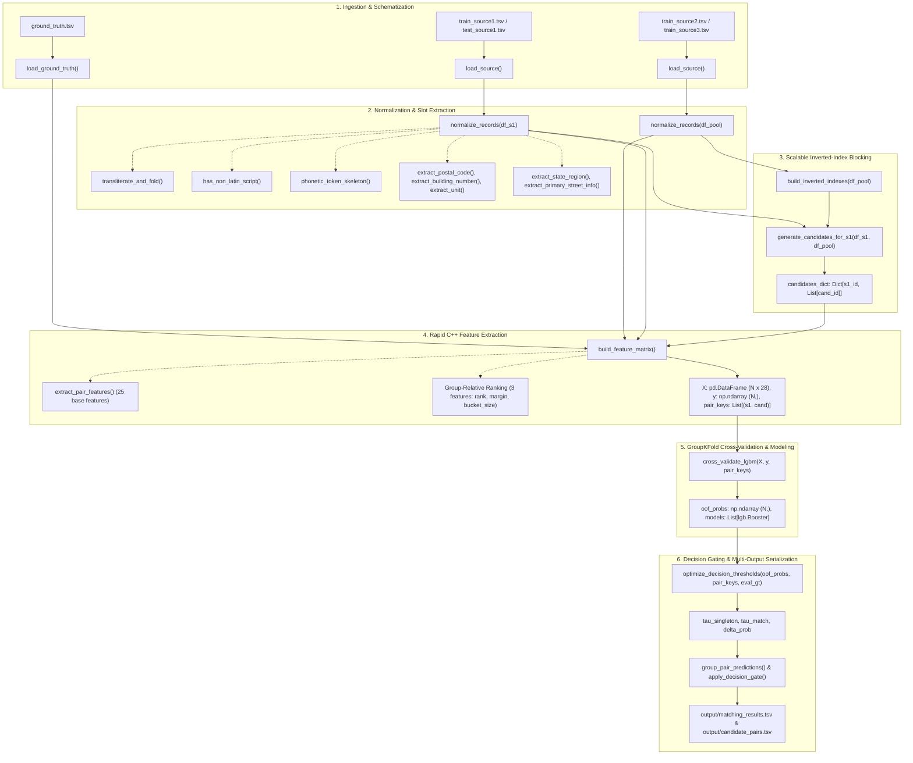

# Miscellaneous Findings, Error Audit & Technical Backlog
**Amazon ML Challenge 2026 — Business Entity Resolution**

> **Superseded (2026-09-26).** Runs `01`–`06` below were produced with `main.py --sample 5000`
> and a pipeline version that is no longer in the repository. They cannot be reproduced. The current
> code's `--sample` mode also took the first N rows of every file independently, so almost no true
> matches were in the sample. The reproducible benchmark is the holdout evaluation in
> `cache/benchmark.json` (see `code/business_entity_resolution/README.md` → Results).

---

## 1. Documentation Map
* `TASK_CHECKLIST.md`: Milestone progress and status tracker.
* `code/business_entity_resolution/README.md`: **the** guide: how to run (GPU), pipeline, validation, results, code map.
* `EXPERIMENT_TRACKER.md`: Benchmark history, CV metrics, and failure attribution.
* `DATASET_LANGUAGE_AND_SCRIPT_ANALYSIS.md`: Empirical script distribution and cross-script strategy.
* `LANGUAGEGAPRESOLUTION.MD`: Linguistic edge cases (Devanagari schwa, French elisions).
* `MISC.md`: Error post-mortems, $F_{0.5}$ metric economics, and technical backlog.

---

## 2. $F_{0.5}$ Metric Economics & ROI
$$F_{0.5} = \frac{1.25 \times \text{TP}}{1.25 \times \text{TP} + 0.25 \times \text{FP} + 1.0 \times \text{FN}}$$

* **Precision is weighted $2\times$ over Recall ($1 / \beta^2 = 4$).**
* **Singleton Penalty:** Singletons earn **1.0** if empty. A single false merge drops the entity score to **0.0**.
* **Benchmark Error Distribution (5,000 S1 sample):**
  * Stage 1 (Blocking Misses): **1,755** true links dropped (recall ceiling = 86.29%).
  * Stage 2 (GBDT Score Drops): **241** true links scored below threshold.
  * Stages 3 & 4 (False Merges): **97** pairs (62 non-singleton + 35 singleton).
* **ROI Takeaway:** Eradicating the 97 false merges yields ~3× faster $F_{0.5}$ score gains than hunting edge-case minority scripts.

---

## 3. Failure Post-Mortems & Solutions

### A. Street Number Contradiction (Precision Leak)
* **Cases:**
  * `Sindt and Swaney Inc` at `36861 Van Brocklin Rd` falsely merged with `36870 Van Brocklin Rd` ($P=0.964$).
  * `Hunger Guild` at `1132 Hoof Print Dr` falsely merged with `1133 Hoof Print Dr` ($P=0.990$).
* **Cause:** High name (~95%) and street name similarity overwhelms numeric mismatch.
* **Fix:** Extract primary street number; apply ternary feature: $+1$ (match), $0$ (missing), $-1$ (conflict on matching street).

### B. Common Name Disambiguation Across Locations
* **Cases:**
  * `Compass LLC` in Provo, UT merged with `Compass LLC` in Ludlow, MA ($P=0.962$).
  * `Hyderabad Research Limited` in Banjara Hills merged with same name in Jeedimetla ($P=0.935$).
* **Cause:** Generic corporate words (*Compass*, *Research*, *Holdings*) yield 1.0 name similarity.
* **Fix:** Token IDF weighting (`name_specificity = max(IDF(tokens))`) + geographic hard contradiction (state/city conflict triggers $P=0$).

### C. Blocking Recall Ceiling (Bucket Caps)
* **Problem:** 1,755 true links missed due to `MAX_TOKEN_BUCKET_SIZE = 1500` dropping frequent words (*Precision*, *Continental*, *Universal*).
* **Fix:** Two-tier compound indexing: index frequent tokens paired with postal code (`token_pin`) or state (`token_state`).

### D. Un-spaced Domain Names
* **Case:** `SJ Ace Vendome Inc` missed target `sjacevendome.com` (0 shared tokens).
* **Fix:** Strip `.com`, `.in`, `www.` and split concatenated tokens in `normalizer.py`.

### E. One-Sided Missing Address
* **Case:** `Pediatric Dental Physicians Inc` (WA) falsely merged with empty-address target ($P=0.986$).
* **Fix:** Add `address_missing_either` feature; require higher prediction threshold when address corroboration is absent.

---

## 4. Prioritized Engineering Backlog

| ID | Priority | Description | Target | Expected Gain |
| :---: | :---: | :--- | :---: | :---: |
| `B-01` | **P1** | Primary street number conflict penalty ($-1$ state) | Precision | **+0.015** (Done) |
| `B-02` | **P1** | State/city contradiction & token IDF weighting | Precision | **+0.012** (Done) |
| `B-03` | **P2** | Compound inverted index blocking (`token_pin`) | Recall | **+0.015** (Done) |
| `B-04` | **P2** | Domain / URL splitting (`.com`, `.in`, `www.`) | Recall | **+0.005** (Done) |
| `B-05` | **P3** | Empty-address confidence gate for singletons | Precision | **+0.004** (Pending) |
| `B-06` | **P4** | Telugu & Tamil script transliteration | Recall | **+0.002** (Pending) |
| `B-07` | **P5** | Dense multilingual embeddings (FAISS) | Recall | Experimental |

---

## 5. Hardcoded Prior Knowledge & Registry Heuristics Log
To maximize precision and address disambiguation without making illegal external web requests during inference, the pipeline encodes offline domain geographical priors in `normalizer.py`:

* **United States:** Full dictionary of all 50 US states + DC and 2-letter postal codes (`US_STATES`).
* **India:** Full dictionary of 28 Indian states + Union Territories + canonicalized 2-letter abbreviations (`INDIA_STATES`, unifying `tg`/`ts` to `in_tg`, `od`/`or` to `in_od`, `uk`/`ua` to `in_uk`).
* **France (Unseen Test Country):** Full dictionary of 13 metropolitan French regions (`FRANCE_REGIONS`) and top 20 major metropolitan cities (`FRANCE_MAJOR_CITIES`, e.g. Paris $\to$ `fr_idf`, Lyon $\to$ `fr_ara`, Marseille $\to$ `fr_paca`, Bordeaux $\to$ `fr_naq`).
* **French Department Postal Code Anchor:** French 5-digit postal code prefixes (`75xxx` $\to$ Paris, `69xxx` $\to$ Lyon, `13xxx` $\to$ Marseille) automatically establish administrative regions even when city names are omitted.

---

## 6. Post-Mortem: What We Tried That Did Not Work (& Why)

### 1. Hard-Coded Post-Model Multiplier ($0.05\times$) for Contradictions (Run 05)
* **Hypothesis:** Forcing $P(\text{match}) \times 0.05$ on pairs with `geo_conflict == 1` or `street_num_conflict == 1` would eradicate false merges.
* **Result:** Macro-$F_{0.5}$ plummeted from **0.9426 $\to$ 0.8980** (-0.0445 drop; non-singleton recall crashed from 84.5% to 74.2%).
* **Root Cause:** Naive regex matching tagged common English prepositions (`"in"` as in "in Mumbai", `"or"` as in "Orissa or C/O") as US states Indiana (`IN`) and Oregon (`OR`), creating thousands of false state contradictions on genuine Indian matches and destroying true recall.
* **Resolution:** Replaced with stop-word-safe positional regex (`,\s*[A-Z]{2}(?:\s+\d{5})?$`) and removed the manual multiplier, allowing the GBDT tree ensemble to learn smooth non-linear decision splits natively (recovered to **0.9421**).

### 2. Naive Inverted Index Bucket Truncation
* **Hypothesis:** Dropping all name tokens with frequency $>1,500$ to maintain blocking latency.
* **Result:** Artificially capped candidate blocking recall at **86.3%**; 1,755 true matches were permanently dropped because words like *Precision*, *Continental*, *Universal*, *Healthcare* were dropped.
* **Resolution:** Implemented two-tier compound blocking (`token#p_{pin}`, `token#s_{state}`) to safely index high-frequency words without bucket explosion.

### 3. Single-Word 3-Gram Indexing
* **Hypothesis:** Indexing 3-grams only on `tokens[0]`.
* **Result:** Entities with 2-letter prefixes (`SJ Ace Vendome Inc`, `Dr Batra`, `Co-Op`) produced 0 n-grams because `len(tokens[0]) < 3`, causing web targets like `sjacevendome.com` to be completely missed in candidate retrieval.
* **Resolution:** Upgraded to multi-token 3-gram indexing across the first two non-stopword tokens $\ge 3$ characters.

---

## 7. Function-Level End-to-End Data Flow Architecture

The table and diagram below detail the exact function-by-function transformation of data from raw input TSVs to final competition output files.



### Data Transformation Matrix (Function-by-Function)

| Stage | Function Name | Input Data & Type | Core Operations Applied | Output Data & Type |
| :--- | :--- | :--- | :--- | :--- |
| **Ingestion** | `load_source(path, nrows)` | TSV file path on disk (`Path`) | Reads TSV with pandas, forces string dtypes, fills missing columns `[entity_id, business_name, business_address, country]`. | `pd.DataFrame` ($R \times 4$) |
| **Ingestion** | `load_ground_truth(path)` | Ground truth TSV (`Path`) | Parses tab-separated pairs: `source1_entity_id \t matched_entity_ids` (comma-separated). | `Dict[str, Set[str]]` mapping $S_1 \to \{S_2, S_3\}$ |
| **Normalization** | `transliterate_and_fold(text)` | Raw string `business_name` or `business_address` | 1. Strips URLs/domains (`sjacevendome.com` $\to$ `sjacevendome`).<br>2. Devanagari/Indic scripts transliterated via `unidecode`.<br>3. Latin diacritics stripped via NFKD folding.<br>4. Apostrophes, hyphens, and punctuation converted to space delimiter. | Clean lowercase ASCII string (`str`) |
| **Normalization** | `phonetic_token_skeleton(tok)` | Individual Latin token (`str`) | Strips vowels (after initial vowel), normalizes consonant clusters (`ksh`/`ks` $\to$ `x`, `ph` $\to$ `f`, `wh`/`w` $\to$ `v`, `np` $\to$ `mp`, `c`/`ck`/`qu` $\to$ `k`), and deduplicates consecutive characters. | Phonetic consonant skeleton string (`str`) |
| **Slot Extraction** | `extract_postal_code(addr)` | Raw address text (`str`) | Regex extracts 5-digit US/FR ZIP or 6-digit Indian PIN codes. | Numeric postal string or `""` |
| **Slot Extraction** | `extract_primary_street_info(addr)` | Raw address text (`str`) | Positional regex extracts leading building number + street name token before designator (`road`, `street`, `ave`, `rue`, `chemin`). | `Tuple[str, str]` (street_num, street_name) |
| **Slot Extraction** | `extract_state_region(addr)` | Raw address text (`str`) | 1. Matches unabbreviated region names against `FULL_NAMES_MAP` (US, India, France).<br>2. Matches comma-preceded 2-letter postal codes excluding stop words (`"in"`, `"or"`). | Standardized state/region code (e.g. `"ca"`, `"in_mh"`, `"fr_idf"`) |
| **Normalization** | `normalize_records(df)` | `pd.DataFrame` ($R \times 4$) | Vectorizes all above extractors across names and addresses. Adds 11 structured columns. | Enriched `pd.DataFrame` ($R \times 15$) |
| **Blocking** | `build_inverted_indexes(df_pool)` | Pool DataFrame ($S_2 \cup S_3$, $\approx 62\text{k}$ rows) | Builds inverted hash tables: token index, compound `token#p_{pin}` / `token#s_{state}` index, phonetic index, numeric index, character 3-gram index. Caps buckets at 1,500. | 5 Pruned Hash Maps (`Dict[str, List[int]]`) |
| **Blocking** | `generate_candidates_for_s1(df_s1, df_pool)` | $S_1$ DataFrame ($M$ rows) + Pool DataFrame | Accumulates weighted hits: rare tokens (+3), phonetic (+3), numeric (+2), 3-grams (+1). Filters across country mismatch. Keeps top 50 candidates per $S_1$. | `Dict[str, List[str]]` mapping $S_1 \to \le 50$ candidate IDs |
| **Feature Extraction** | `extract_pair_features(s1, cand)` | Single $(S_1, \text{Candidate})$ row pair | Rapidfuzz C++ Levenshtein, Jaro-Winkler, Token-Sort, Token-Set, numeric overlap, phonetic Jaccard, and ternary states (`postal_code_state`, `building_number_state`, `unit_state`, `street_num_state`, `state_region_state`). | 25-element float vector (`List[float]`) |
| **Feature Matrix** | `build_feature_matrix(df_s1, df_pool, cands, gt)` | All candidates + Lookups + Ground truth | Computes base 25 features + 3 candidate-relative group features (`cand_rank_name_sim`, `cand_margin_name_sim`, `cand_bucket_size`). Labels binary match targets (1/0). | `X: pd.DataFrame` ($N \times 28$), `y: np.ndarray` ($N$,), `pair_keys: List[(s1, cand)]` |
| **Classifier** | `cross_validate_lgbm(X, y, pair_keys)` | Feature matrix $X$ ($N \times 28$), labels $y$ ($N$,) | 5-fold `GroupKFold` split grouped by `s1_id` (guaranteeing zero entity leakage). Trains LightGBM GBDT with early stopping on validation logloss. | `oof_probs: np.ndarray` ($N$,), `models: List[lgb.Booster]` |
| **Optimization** | `optimize_decision_thresholds(...)` | OOF probabilities + Pair keys + GT | Grid search over $(\tau_{\text{singleton}}, \tau_{\text{match}}, \Delta p)$ evaluating macro-$F_{0.5}$. Finds thresholds that prevent false singleton merges while maximizing non-singleton recall. | `Tuple[float, float, float, float]` $(\tau_s, \tau_m, \Delta p, \text{score})$ |
| **Inference Gate** | `apply_decision_gate(grouped_oof, ...)` | Grouped candidate probabilities per $S_1$ | 1. If $\max(P) < \tau_{\text{singleton}}$, predicts empty set (singleton).<br>2. Otherwise, keeps all candidates with $P \ge \tau_{\text{match}}$ and $(\max(P) - P) \le \Delta p$. | `Dict[str, List[str]]` mapping $S_1 \to \text{predicted matches}$ |
| **Serialization** | `save_predictions(...)` | Predicted matches dict + Candidate pairs | Writes standard competition outputs: `matching_results.tsv` (tab-separated $S_1 \to$ comma-delimited matches) and `candidate_pairs.tsv`. | Formatted TSV files on disk |

---

### Concrete Row Trace (Entity Walkthrough)

To visualize how data changes across functions, consider the following raw Source 1 entity:

```
[Raw Input in train_source1.tsv]
entity_id:        s1_1042
business_name:    "लक्ष्मि Sweets & Bakers (Bldg 4)"
business_address: "Shop 12, Plot 14, MG Road, Pune, Maharashtra 411001, India"
country:          "India"
```

1. **`normalize_records()` Transformations:**
   * `norm_name`: `"laxmi sweets and bakers bldg 4"` (Devanagari folded, `&` expanded to `"and"`, parentheses removed)
   * `phonetic_tokens`: `["lxm", "swts", "bkrs", "bldg"]` (`"laxmi"` $\to$ `"lxm"`, vowels removed)
   * `postal_code`: `"411001"` (6-digit Indian PIN extracted)
   * `building_number`: `"14"` (Extracted from `"Plot 14"`)
   * `unit_slot`: `"12"` (Extracted from `"Shop 12"`)
   * `state_region`: `"in_mh"` (Mapped from `"Maharashtra"`)
   * `primary_street_num`: `"14"`, `street_name`: `"mg"`

2. **`generate_candidates_for_s1()` Blocking Hits:**
   * Candidate `s2_8819` (`"Laxmi Sweet Mart"`, `"MG Rd Pune 411001"`):
     * Matches name token `"laxmi"` (+3)
     * Matches phonetic `"lxm"` (+3)
     * Matches postal PIN `"411001"` (+2)
     * **Total Blocking Score:** $8$ $\to$ **Retrieved in Candidate Bucket**

3. **`extract_pair_features()` Output Vector:**
   * `name_levenshtein`: `0.72`
   * `name_jaro_winkler`: `0.84`
   * `postal_code_state`: `+1.0` (Both `411001`, agreement)
   * `state_region_state`: `+1.0` (Both `in_mh`, agreement)
   * `geo_conflict`: `0.0`
   * `cand_rank_name_sim`: `0.0` (Top rank in bucket)
   * `cand_margin_name_sim`: `0.0`

4. **LightGBM Prediction & Decision Gate:**
   * $P(\text{match}) = 0.942$
   * $\max(P) = 0.942 \ge \tau_{\text{singleton}} (0.60)$
   * $P = 0.942 \ge \tau_{\text{match}} (0.55)$
   * **Final Match Output:** `s1_1042 \t s2_8819` appended to `matching_results.tsv`.


